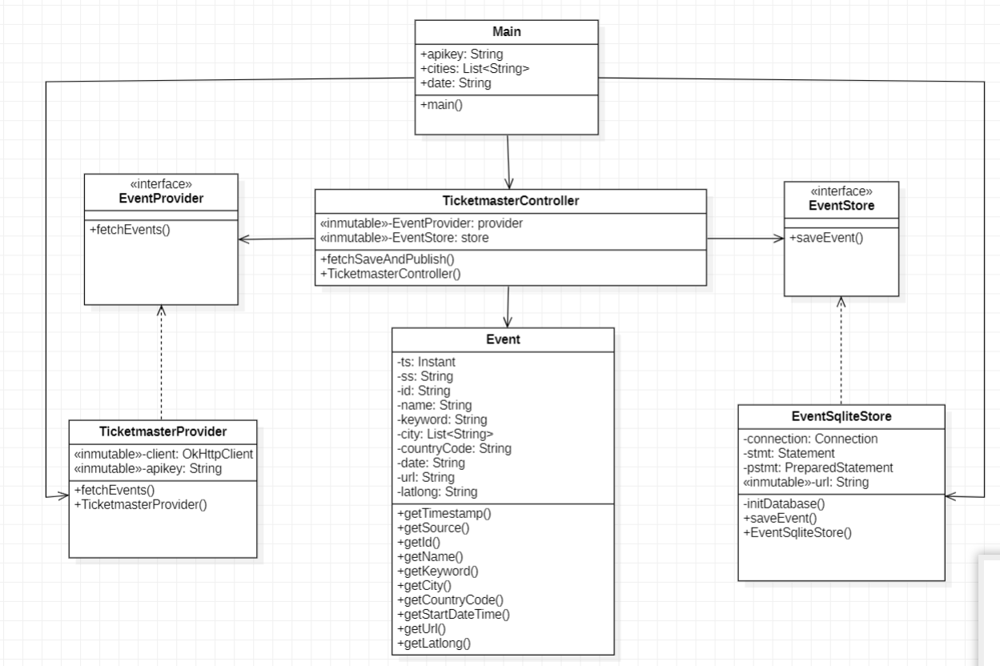
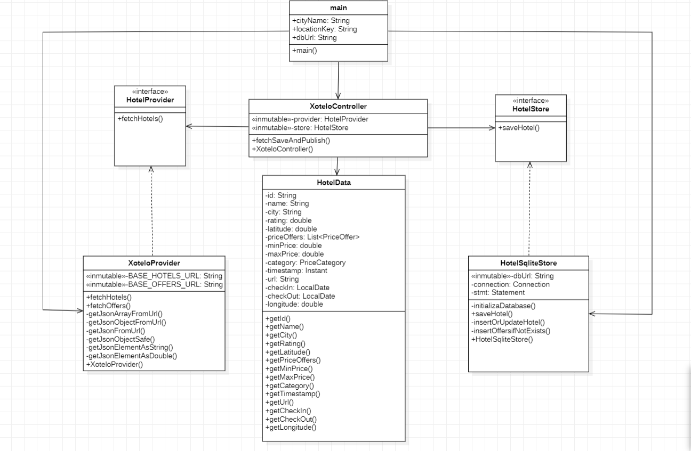
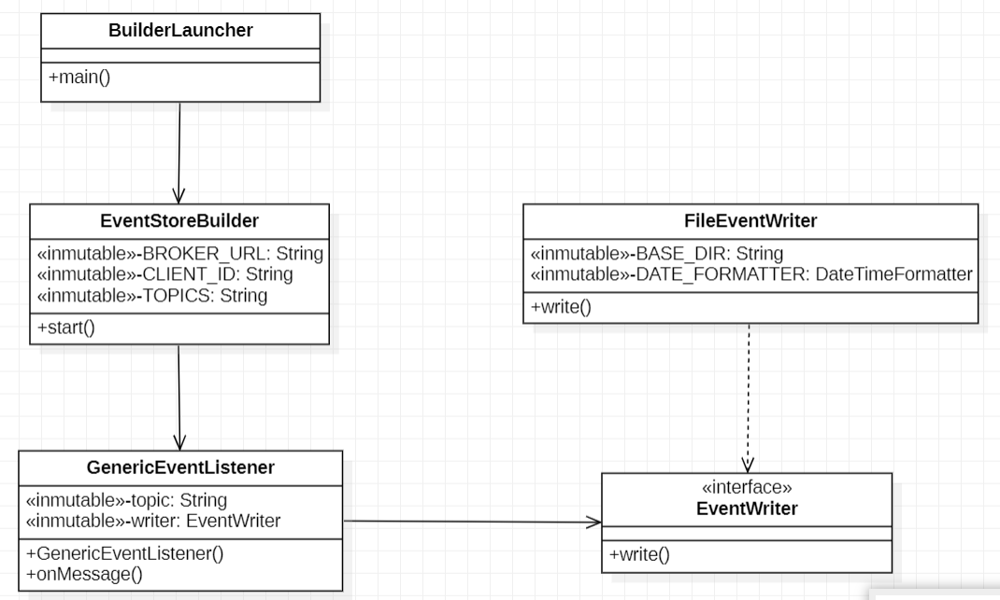

# Data Science Integration Project: Hotel Recommendation for Events

Alfonso Santana Morquecho <br>
Nicole María Ortega Ojeda <br> <br>
University of Las Palmas de Gran Canaria <br>
Subject: Data science application development

---
## 1. Project Overview

**Project Objectives:**

The main objective of this project is to integrate and process real-time and delayed data from 
the **Xotelo** and **Ticketmaster** APIs to offer users personalized accommodation recommendations 
based on their event interests. By analyzing the events selected on Ticketmaster, the system will identify key locations
and dates and cross-reference this information with Xotelo to suggest accommodation options tailored to different 
price ranges. This seeks to optimize the user experience, facilitating travel and stay planning, 
while adding value by combining two data sources into a single, functional product.
It is a modular, event-driven system built in Java 21 that uses **ActiveMQ** as a message broker 
and supports both **real-time processing** and **historical data analysis**.

---
## 2. Value Proposition
> Help users plan smarter by recommending hotels based on events they plan to attend — filtered by price and rating.

The system:
- Periodically fetches data from two public APIs.
- Publishes standardized events to a message broker.
- Stores events in `.events` files for later analysis.
- Analyzes data via an in-memory **datamart** and interactive CLI.

---
## 3. API & Datamart Justification

### APIs used:

| API               | Url                                                                          |Why it was chosen |
|-------------------|------------------------------------------------------------------------------|-------------------|
| **Ticketmaster**  | https://developer.ticketmaster.com/products-and-docs/apis/discovery-api/v2/  | Dynamic event data (concerts, sports, etc.) with location and time |
| **Xotelo**        | Hotels: https://data.xotelo.com/api/list?location_key=citykey&offset=0&limit=5<br>  Offers: https://data.xotelo.com/api/rates?hotel_key=hotelkey&chk_in=2025-07-16&chk_out=2025-07-20   | Hotel listings with real-time rates by city and date |    

### Datamart Design:

The Datamart in the Business Unit module acts as a in-memory data store for events and hotels, providing efficient data retrieval and filtering for real-time and historical analytics. It has two main components: <br>
1. Data Structures
- `hotelesPorCiudad (Map<String, Map<String, HotelEvent>)` - Stores hotels grouped by city, allowing efficient city-based hotel lookups.
- `eventos (List<EventInfo>)` - Stores all known events for fast retrieval and search by name.

2. Main Methods
- `addEvent(HotelEvent)` - Adds a hotel event to the city-specific map.
- `addEvent(EventInfo)` - Adds a general event to the event list.
- `getEventos()` - Returns the list of all known events.
- `findEventoByNombre(String name)` - Finds an event by name.
- `getHotelesFiltrados(String ciudad, double eventoLat, double eventoLon, FiltroHotel filtro)` - Gets hotels filtered by city, price, category, rating, and distance.

---
## 4. Build and Run Instructions

### Requirements

- Java 21
- Maven
- ActiveMQ (running on `localhost:61616`)
- SQLite driver (included)

---

### Modules

**Event-Feeder Module:** <br>
Retrieves event data from the Ticketmaster API and publishes this data to the `event.Event` topic on ActiveMQ. <br>
Includes classes and packages like:
- **Main:** Entry point for the event feeder. Initializes the controller and sets up a scheduler for periodic event data fetching.
- **TicketmasterController:** Coordinates fetching, storing, and publishing hotel data to ActiveMQ, using the HotelProvider and HotelStore interfaces. <br>
- *application:* <br>
**EventProvider:** Interface for classes that fetch event data from external sources. <br>
**EventStore:** Interface for classes that store event data.<br>
- *domain.model:* <br>
**Event:** Represents an event with attributes like ID, name, location, date, and URL.<br>
- *infrastructure:* <br>
**TicketmasterProvider:** Fetches event data from the Ticketmaster API and converts it into Event objects. <br>
**EventSqliteStore:** Stores event data in a local SQLite database.



**Hotel-Feeder Module:** <br>
Retrieves hotel and pricing data from the Xotelo API. Publishes this data to the hotel.Hotel topic on ActiveMQ. <br>
Includes classes and packages like:
- **Main:** Entry point for the hotel feeder. Initializes the controller and sets up a scheduler for periodic hotel data fetching.
- **XoteloController:** Coordinates fetching, storing, and publishing hotel data to ActiveMQ, using the HotelProvider and HotelStore interfaces. <br>
- *application:* <br>
**HotelProvider:** Defines de fetching of hotel data received. <br>
**HotelStore:** Defines the storing hotel data in a persistent database.<br>
- *model:* <br>
**HotelData:** Represents hotel details including prices, location, and rating.<br>
- *infrastructure:* <br>
**XoteloProvider:** Implements HotelProvider, fetching hotel and price data from the Xotelo API. <br>
**HotelSqliteStore:** Implements HotelStore, managing local SQLite storage for hotel and offer data.




**Event-Store-Builder Module:** <br>
Subscribes to the message broker and stores events in `.events` files for later processing. Manages event serialization and file storage. <br>
It has the following structure:
- *core:* <br>
**EventStoreBuilder:** Connects to ActiveMQ and creates subscribers to receive event messages. <br>
- *launcher:* <br>
**BuilderLauncher:** Starts the event listening process using EventStoreBuilder. <br>
- *listener:* <br>
**GenericEventListener:** Handles incoming messages and sends them to an EventWriter for persistence.<br>
- *writer:* <br>
**FileEventWriter:** Saves events to files, organized by topic and date. <br>
**EventWriter:** Defines the contract for writing events to persistent storage.

  



**Business-Unit Module:** <br> 
Processes stored events to generate user-friendly recommendations based on city, date, price, and rating. Provides in-memory data structures for fast analysis. <br>
The structure of this module is: 

- **BusinessLauncher:** Starts the business unit and filters hotels for a given event based on user input. <br>
- **BusinessUnit:** Manages the datamart, loads historical data, and provides filtered hotel recommendations for events. <br>
- **Datamart:** Stores and retrieves event and hotel data, applying filters for location, price, rating, and distance. <br>
- **EventSubscriber:** Subscribes to ActiveMQ topics for real-time event and hotel data updates. <br>
- **HistoricalEventLoader:** Loads historical hotel events from files into the datamart.


**Business-Api Module:**
- Serves as the RESTful interface for the project, allowing external clients to query hotel data based on event preferences.
- It exposes HTTP endpoints for filtering and retrieving hotel recommendations, bridging the gap between the core business logic in the Business Unit and user-facing applications.
  
**Shared-Model Module:**
- Is responsible for providing common data structures and utilities that are used across the various project modules, including Event-Feeder, Hotel-Feeder, and Business-Unit.


> Each module has a package called test, which includes some tests to verify the correct operation of the module.
> Packages are not included on the class diagrams.
---
### How to run the program


---
## 5. Resources

The project was developed using IntelliJ IDEA, a powerful and highly integrated IDE widely adopted in the software industry. It provides seamless integration with various tools and technologies, streamlining the development process. For version control, Git was used to meticulously track source code changes, while GitHub served as the cloud-based repository for hosting the project's codebase.

For dependency management and build automation, Maven was utilized, simplifying the compilation, testing, and packaging of the project. The following dependencies were included:

Gson - Library to convert Java objects to JSON.
```
<dependency>
            <groupId>com.google.code.gson</groupId>
            <artifactId>gson</artifactId>
            <version>2.9.1</version>
</dependency>
```

JUnit - Framework for writing and running unit tests in Java.
```
<dependency>
            <groupId>org.junit.jupiter</groupId>
            <artifactId>junit-jupiter</artifactId>
            <version>5.9.3</version>
            <scope>test</scope> 
</dependency>
```

OkHttp3 - HTTP client for making network requests efficiently.
```
<dependency>
            <groupId>com.squareup.okhttp3</groupId>
            <artifactId>okhttp</artifactId>
            <version>4.9.3</version>
</dependency>
```

SQLite JDBC - JDBC driver to connect Java applications to SQLite databases.
```
<dependency>
            <groupId>org.xerial</groupId>
            <artifactId>sqlite-jdbc</artifactId>
            <version>3.36.0.3</version>
</dependency>
```

Json - Library for parsing, generating, and manipulating JSON data.
```
<dependency>
            <groupId>org.json</groupId>
            <artifactId>json</artifactId>
            <version>20220320</version>
</dependency>
```

Jsoup - HTML parser for extracting and manipulating data from web pages.
```
<dependency>
            <groupId>org.jsoup</groupId>
            <artifactId>jsoup</artifactId>
            <version>1.14.3</version>
</dependency>
```

Apache Spark - Lightweight web framework for creating web applications and APIs.
```        
<dependency>
            <groupId>com.sparkjava</groupId>
            <artifactId>spark-core</artifactId>
            <version>2.9.4</version>
</dependency>
```


SLF4J - Simple logging facade to plug in various logging frameworks.
```
<dependency>
            <groupId>org.slf4j</groupId>
            <artifactId>slf4j-api</artifactId>
            <version>2.0.9</version>
</dependency>
```

ActiveMQ - Client library to interact with Apache ActiveMQ message broker.
```
<dependency>
            <groupId>org.apache.activemq</groupId>
            <artifactId>activemq-client</artifactId>
            <version>5.18.4</version>
</dependency>
```

---
## 6. Future improvements
Some future improvements for this Hotel Recommender project could be: 

1. Enhanced Error Handling and Logging:<br>
Implement more robust error handling mechanisms and comprehensive logging to improve the reliability and the debugging.

2. Integration with Additional APIs:<br>
Expand the system's capabilities integrating other relevant APIs to provide a broader range of data.

3. User Interface Development:<br>
Develop a user-friendly interface to enhance user experience and accessibility.
